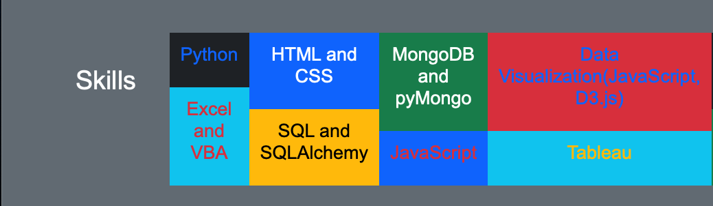
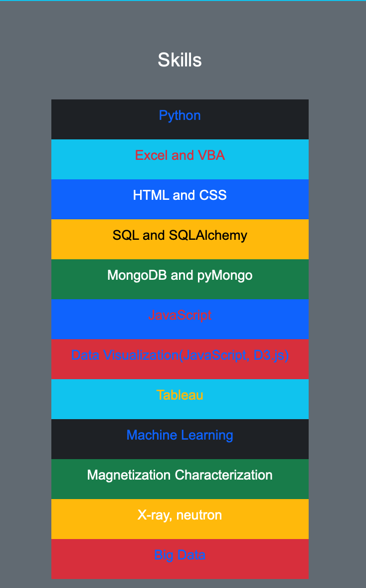
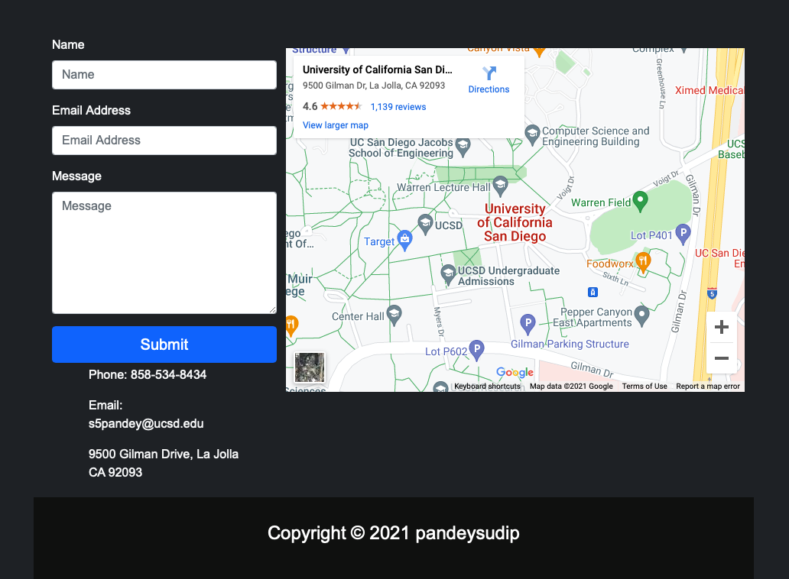

# webpage-bootstrap
## Background

Creating a website using HTML, CSS, and Bootstrap.

The website is deployed to GitHub at:  
https://pandeysudip.github.io/bio/

### Screenshots

This section contains screenshots of each page:

#### Landing page

Large screen:

Small screen:

#### Comparisons page

Large screen:

Small screen:

#### Data page

Large screen:

Small screen:

#### Visualization pages

Large screen:

Small screen:

#### Navigation menu

Large screen:

